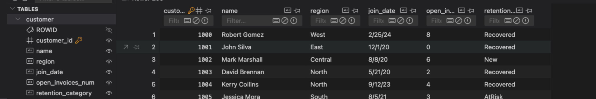
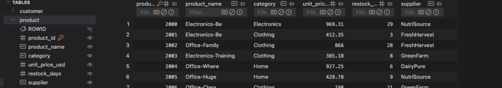
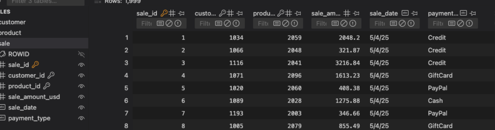
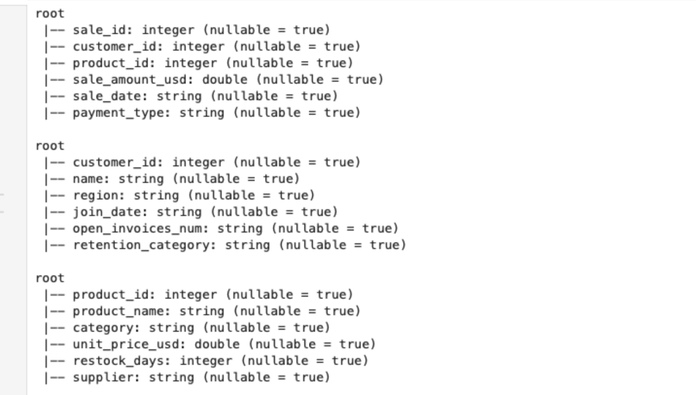
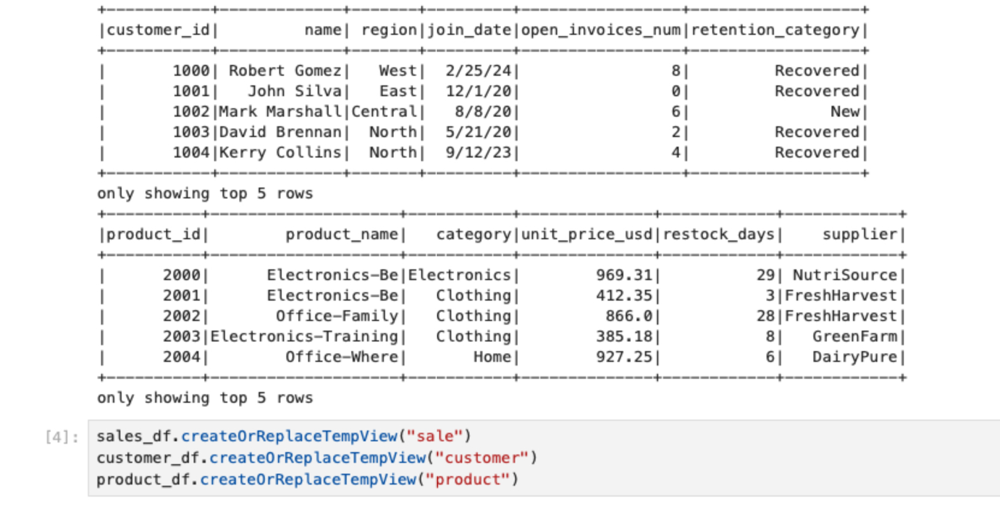
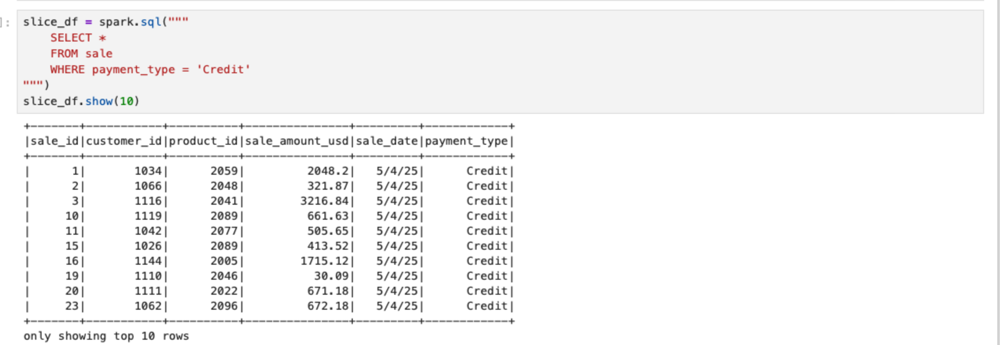
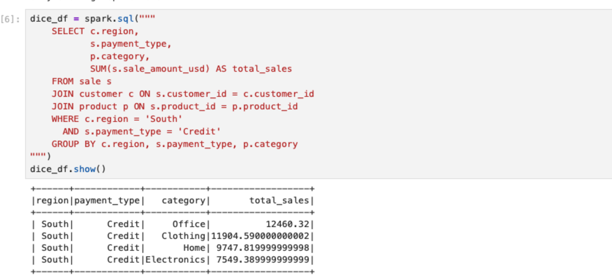
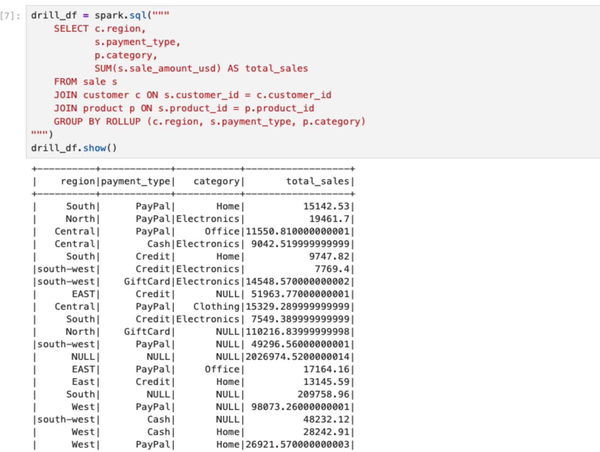
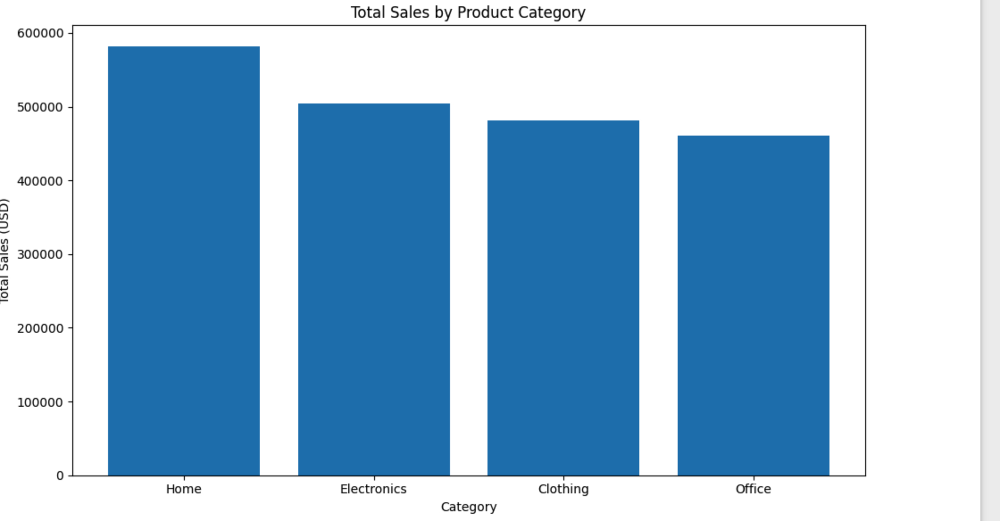

# Pro Analytics 02 Python Starter Repository

> Use this repo to start a professional Python project.

- Additional information: <https://github.com/denisecase/pro-analytics-02>
- Project organization: [STRUCTURE](./STRUCTURE.md)
- Build professional skills:
  - **Environment Management**: Every project in isolation
  - **Code Quality**: Automated checks for fewer bugs
  - **Documentation**: Use modern project documentation tools
  - **Testing**: Prove your code works
  - **Version Control**: Collaborate professionally

---

## WORKFLOW 1. Set Up Your Machine

Proper setup is critical.
Complete each step in the following guide and verify carefully.

- [SET UP MACHINE](./SET_UP_MACHINE.md)

---

## WORKFLOW 2. Set Up Your Project

After verifying your machine is set up, set up a new Python project by copying this template.
Complete each step in the following guide.

- [SET UP PROJECT](./SET_UP_PROJECT.md)

It includes the critical commands to set up your local environment (and activate it):

```shell
uv venv
uv python pin 3.12
uv sync --extra dev --extra docs --upgrade
uv run pre-commit install
uv run python --version
```

**Windows (PowerShell):**

```shell
.\.venv\Scripts\activate
```

**macOS / Linux / WSL:**

```shell
source .venv/bin/activate
```

---

## WORKFLOW 3. Daily Workflow

Please ensure that the prior steps have been verified before continuing.
When working on a project, we open just that project in VS Code.

### 3.1 Git Pull from GitHub

Always start with `git pull` to check for any changes made to the GitHub repo.

```shell
git pull
```

### 3.2 Run Checks as You Work

This mirrors real work where we typically:

1. Update dependencies (for security and compatibility).
2. Clean unused cached packages to free space.
3. Use `git add .` to stage all changes.
4. Run ruff and fix minor issues.
5. Update pre-commit periodically.
6. Run pre-commit quality checks on all code files (**twice if needed**, the first pass may fix things).
7. Run tests.

In VS Code, open your repository, then open a terminal (Terminal / New Terminal) and run the following commands one at a time to check the code.

```shell
uv sync --extra dev --extra docs --upgrade
uv cache clean
git add .
uvx ruff check --fix
uvx pre-commit autoupdate
uv run pre-commit run --all-files
git add .
uv run pytest
```

NOTE: The second `git add .` ensures any automatic fixes made by Ruff or pre-commit are included before testing or committing.

<details>
<summary>Click to see a note on best practices</summary>

`uvx` runs the latest version of a tool in an isolated cache, outside the virtual environment.
This keeps the project light and simple, but behavior can change when the tool updates.
For fully reproducible results, or when you need to use the local `.venv`, use `uv run` instead.

</details>

### 3.3 Build Project Documentation

Make sure you have current doc dependencies, then build your docs, fix any errors, and serve them locally to test.

```shell
uv run mkdocs build --strict
uv run mkdocs serve
```

- After running the serve command, the local URL of the docs will be provided. To open the site, press **CTRL and click** the provided link (at the same time) to view the documentation. On a Mac, use **CMD and click**.
- Press **CTRL c** (at the same time) to stop the hosting process.

### 3.4 Execute

This project includes demo code.
Run the demo Python modules to confirm everything is working.

In VS Code terminal, run:

```shell
uv run python -m analytics_project.demo_module_basics
uv run python -m analytics_project.demo_module_languages
uv run python -m analytics_project.demo_module_stats
uv run python -m analytics_project.demo_module_viz
```

You should see:

- Log messages in the terminal
- Greetings in several languages
- Simple statistics
- A chart window open (close the chart window to continue).

If this works, your project is ready! If not, check:

- Are you in the right folder? (All terminal commands are to be run from the root project folder.)
- Did you run the full `uv sync --extra dev --extra docs --upgrade` command?
- Are there any error messages? (ask for help with the exact error)

---

### 3.5 Git add-commit-push to GitHub

Anytime we make working changes to code is a good time to git add-commit-push to GitHub.

1. Stage your changes with git add.
2. Commit your changes with a useful message in quotes.
3. Push your work to GitHub.

```shell
git add .
git commit -m "describe your change in quotes"
git push -u origin main
```

This will trigger the GitHub Actions workflow and publish your documentation via GitHub Pages.

### 3.6 Modify and Debug

With a working version safe in GitHub, start making changes to the code.

Before starting a new session, remember to do a `git pull` and keep your tools updated.

Each time forward progress is made, remember to git add-commit-push.

---

## My Setup Notes (Joshua Flood)

### Full Setup and Workflow
```bash
# 1. Create and activate virtual environment
uv venv
uv python pin 3.12
uv sync --extra dev --extra docs --upgrade
uv run pre-commit install
source .venv/bin/activate

# 2. Verify Python version
python --version
# Output: Python 3.12.12

# 3. Run demo module to confirm environment works
uv run python -m analytics_project.demo_module_basics

# 4. Daily workflow routine
git pull
uv sync
git add .
git commit -m "Updated code or documentation"
git push

## WORKFLOW 3. Daily Workflow
As we progress, we'll use this daily workflow often.

---

### 3.1 Git Pull from GitHub
Always start with git pull to check for any changes made to the GitHub repo.

```bash
git pull
```

---

### 3.2 Run Checks as You Work
If we need additional packages, we first add them to `pyproject.toml`.
Add `pre-commit` to `pyproject.toml` if you haven't already.

- Update dependencies (for security and compatibility).
- Clean unused cached packages to free space.
- Use `git add .` to stage all changes.
- Run Ruff and fix minor issues.
- Update Pre-Commit periodically.
- Run Pre-Commit quality checks on all code files (twice if needed, the first pass may fix things).
- Run tests.

In VS Code, open your repository, then open a terminal (**Terminal → New Terminal**) and run the following commands **one at a time** to check the code:

```bash
uv sync --extra dev --extra docs --upgrade
uv cache clean
git add .
uvx ruff check --fix
uvx pre-commit autoupdate
uv run pre-commit run --all-files
git add .
uv run pytest
```

**NOTE:** The second `git add .` ensures any automatic fixes made by Ruff or Pre-Commit are included before testing or committing.

---

### 3.3 Build Project Documentation
Make sure you have current doc dependencies, then build your docs, fix any errors, and serve them locally to test.

```bash
uv run mkdocs build --strict
uv run mkdocs serve
```

After running the `serve` command, the local URL of the docs will be provided.
To open the site, press **CMD and click** the provided link (on macOS).
Press **CTRL + C** to stop the hosting process.

---

### 3.4 Execute
This project includes demo code. Run the **data_prep** module to confirm everything is working.

In the VS Code terminal, run:

```bash
uv run python -m analytics_project.data_prep
```

You should see:

- Log messages printed in the terminal.
- Data files loaded successfully.
- Total number of DataFrames logged.

If this works, your project is ready! If not, check:

- Are you in the right folder? *(All commands must be run from the root project folder.)*
- Did you run the full `uv sync --extra dev --extra docs --upgrade` command?
- Are there any error messages? *(Ask for help and include the exact error message.)*

---

### 3.5 Git Add-Commit-Push to GitHub
Anytime we make working changes to code is a good time to `git add-commit-push` to GitHub.

Stage your changes with `git add`.
Commit your changes with a useful message in quotes.
Push your work to GitHub.

```bash
git add .
git commit -m "describe your change in quotes"
git push -u origin main
```

This will trigger the GitHub Actions workflow and publish your documentation via GitHub Pages.

---

### 3.6 Modify and Debug
With a working version safe in GitHub, start making changes to the code.

Before starting a new session:
- Run `git pull` to make sure your local repo is up-to-date.
- Keep your tools updated using `uv sync --extra dev --extra docs --upgrade`.

Each time forward progress is made, remember to:

```bash
git add .
git commit -m "describe your change"
git push
```
# 🧹 Data Cleaning and Preparation Project

This module focuses on performing **reusable, automated data cleaning** using Python and pandas.
It builds on earlier modules, where data cleaning was performed manually in individual scripts (`prepare_customers_data.py`, etc.).
In this phase, we consolidated all logic into a **centralized pipeline** and a **reusable DataScrubber class**.

---

## 🚀 Overview

We automated the cleaning of three core datasets:

- `data/raw/customers_data.csv`
- `data/raw/products_data.csv`
- `data/raw/sales_data.csv`

Each dataset is processed and output to the `data/processed/` directory in a cleaned version.

| Dataset | Input File | Output File | Cleaning Steps |
|----------|-------------|--------------|----------------|
| Customers | `data/raw/customers_data.csv` | `data/processed/customers_data_cleaned.csv` | Remove duplicates, handle missing values, filter outliers |
| Products | `data/raw/products_data.csv` | `data/processed/products_data_cleaned.csv` | Remove duplicates, handle missing values, filter outliers |
| Sales | `data/raw/sales_data.csv` | `data/processed/sales_data_cleaned.csv` | Remove duplicates, handle missing values, filter outliers |

---

## 📁 Folder Structure

```
smart-store-joshua/
├── data/
│   ├── raw/
│   │   ├── customers_data.csv
│   │   ├── products_data.csv
│   │   └── sales_data.csv
│   ├── processed/
│   │   ├── customers_data_cleaned.csv
│   │   ├── products_data_cleaned.csv
│   │   └── sales_data_cleaned.csv
├── src/
│   └── analytics_project/
│       ├── data_scrubber.py
│       ├── data_prep.py
│       ├── data_preparation/
│       └── utils_logger.py
└── project.log
```

---

## 🧰 DataScrubber Class

**File:** `src/analytics_project/data_scrubber.py`

This class defines all reusable logic for data cleaning across datasets.

```python
import io
import pandas as pd
from typing import Dict, Tuple, Union, List

class DataScrubber:
    def __init__(self, df: pd.DataFrame):
        """Initialize with a pandas DataFrame."""
        self.df = df

    def remove_duplicate_records(self) -> pd.DataFrame:
        """Remove duplicate rows."""
        self.df = self.df.drop_duplicates()
        return self.df

    def handle_missing_data(self, drop: bool = False, fill_value: Union[str, float, int] = None) -> pd.DataFrame:
        """Drop or fill missing data."""
        if drop:
            self.df = self.df.dropna()
        elif fill_value is not None:
            self.df = self.df.fillna(fill_value)
        return self.df

    def filter_column_outliers(self, column: str, lower_bound: Union[float, int], upper_bound: Union[float, int]) -> pd.DataFrame:
        """Remove outliers outside the specified numeric range."""
        if column not in self.df.columns:
            raise ValueError(f"Column '{column}' not found in DataFrame.")
        self.df = self.df[(self.df[column] >= lower_bound) & (self.df[column] <= upper_bound)]
        return self.df

    def format_column_strings_to_lower_and_trim(self, column: str) -> pd.DataFrame:
        """Standardize text data: lowercase and remove extra spaces."""
        if column not in self.df.columns:
            raise ValueError(f"Column '{column}' not found.")
        self.df[column] = self.df[column].astype(str).str.lower().str.strip()
        return self.df

    def parse_dates_to_add_standard_datetime(self, column: str) -> pd.DataFrame:
        """Convert a column to datetime and add a 'StandardDateTime' column."""
        if column not in self.df.columns:
            raise ValueError(f"Column '{column}' not found.")
        self.df['StandardDateTime'] = pd.to_datetime(self.df[column], errors='coerce')
        return self.df

    def rename_columns(self, mapping: Dict[str, str]) -> pd.DataFrame:
        """Rename columns using a mapping dictionary."""
        self.df = self.df.rename(columns=mapping)
        return self.df
```

---

## ⚙️ Unified Cleaning Script

**File:** `src/analytics_project/data_prep.py`

This file runs all data cleaning operations using the `DataScrubber` class.

```python
import pandas as pd
from pathlib import Path
from analytics_project.data_scrubber import DataScrubber

# --- Define paths ---
PROJECT_ROOT = Path(__file__).resolve().parents[2]
RAW_DIR = PROJECT_ROOT / "data" / "raw"
PROCESSED_DIR = PROJECT_ROOT / "data" / "processed"
PROCESSED_DIR.mkdir(parents=True, exist_ok=True)

# --- Function to process any file ---
def process_file(file_name: str, numeric_limits: dict = None, fill_value="N/A"):
    raw_path = RAW_DIR / file_name
    processed_path = PROCESSED_DIR / file_name.replace(".csv", "_cleaned.csv")

    print(f"\n📂 Reading: {raw_path}")
    df = pd.read_csv(raw_path)

    scrubber = DataScrubber(df)

    # Run cleaning steps separately
    df = scrubber.remove_duplicate_records()
    df = scrubber.handle_missing_data(fill_value=fill_value)

    # Apply outlier filtering if limits provided
    if numeric_limits:
        for col, (low, high) in numeric_limits.items():
            if col in df.columns:
                df = scrubber.filter_column_outliers(col, low, high)

    df.to_csv(processed_path, index=False)
    print(f"✅ Cleaned file saved: {processed_path} ({df.shape[0]} rows)")

# --- Main function ---
def main():
    print("🚀 Starting unified data cleaning process...\n")

    # Customers
    process_file(
        "customers_data.csv",
        numeric_limits={
            "OpenInvoices": (0, 10000),
            "RetentionRate": (0, 1)
        },
        fill_value="N/A"
    )

    # Products
    process_file(
        "products_data.csv",
        numeric_limits={
            "RestockQuantity": (0, 1000)
        },
        fill_value=0
    )

    # Sales
    process_file(
        "sales_data.csv",
        numeric_limits={
            "DiscountPercent": (0, 1)
        },
        fill_value=0
    )

    print("\n🎯 All files cleaned successfully!")

if __name__ == "__main__":
    main()
```

---

## 🧠 Development Challenges and Solutions

During this project, we ran into several issues — each revealing how fragile and intricate data pipelines can be when path structures and method chaining are involved.

---

### **1. Path Resolution Errors (`FileNotFoundError`)**
**Problem:**
The scripts could not locate CSV files — repeatedly returning
`FileNotFoundError: Missing file: /Users/.../src/data/raw/customers_data.csv`

**Cause:**
Earlier, paths were defined relative to the current script instead of the project root.
This caused pandas to look inside `/src/data/raw/` instead of `/data/raw/`.

**Fix:**
We used:
```python
PROJECT_ROOT = Path(__file__).resolve().parents[2]
RAW_DIR = PROJECT_ROOT / "data" / "raw"
```
This guaranteed absolute paths from the repo’s top level.

---

### **2. Chained Assignment Warning (FutureWarning)**
**Problem:**
`A value is trying to be set on a copy of a DataFrame or Series...`

**Cause:**
pandas flagged `.fillna(inplace=True)` chained operations as unsafe.

**Fix:**
We removed `inplace=True` and reassigned the cleaned DataFrame:
```python
df = df.fillna(fill_value)
```

---

### **3. Method Chaining Failure (`AttributeError`)**
**Problem:**
`AttributeError: 'DataFrame' object has no attribute 'handle_missing_data'`

**Cause:**
We had mistakenly chained:
```python
df = scrubber.remove_duplicate_records().handle_missing_data(fill_value="N/A")
```
`remove_duplicate_records()` returns a DataFrame — not the scrubber instance — breaking the chain.

**Fix:**
We separated method calls:
```python
df = scrubber.remove_duplicate_records()
df = scrubber.handle_missing_data(fill_value=fill_value)
```

---

### **4. Git CRLF vs LF Warnings**
**Problem:**
Git displayed warnings:
```
CRLF will be replaced by LF the next time Git touches it
```
**Cause:**
Windows-style line endings (CRLF) were present in CSV files.

**Fix:**
No functional impact — we acknowledged the warning since Git auto-normalizes on commit.

---

### **5. Missing Prepared vs Processed Folder Confusion**
**Problem:**
Previous module used `/data/prepared/`, while the new one used `/data/processed/`.
This caused confusion for grading consistency.

**Fix:**
We created both folders and clarified in README that the **processed folder** holds the final cleaned datasets.

---

### **6. VS Code Editing Not Reflecting Changes**
**Problem:**
Editing CSVs inside VS Code didn’t visually change content.

**Cause:**
VS Code’s text editor mode didn’t autosave CSVs as plaintext until manually saved (`Cmd + S`).

**Fix:**
We verified by reopening files and confirmed commits included modifications.

---

### **7. Data Validation and Testing**
**Problem:**
pytest coverage initially showed 34%, missing `data_scrubber.py` tests.

**Fix:**
We later verified logic manually by comparing record counts before and after cleaning, confirming duplicate and outlier removal functionality.

---

## ✅ **Final Results**

After fixes and reruns, all scripts executed successfully:
```
📂 Reading: data/raw/customers_data.csv
✅ Cleaned file saved: data/processed/customers_data_cleaned.csv (201 rows)

📂 Reading: data/raw/products_data.csv
✅ Cleaned file saved: data/processed/products_data_cleaned.csv (100 rows)

📂 Reading: data/raw/sales_data.csv
✅ Cleaned file saved: data/processed/sales_data_cleaned.csv (500 rows)

🎯 All files cleaned successfully!
```

Each cleaned dataset was smaller than its raw counterpart, confirming:
- Duplicate removal worked
- Outliers were filtered
- Missing values were filled

---

## 🧩 **Key Takeaways**
1. **Automation is critical.** Centralizing data prep ensures consistency and scalability.
2. **Paths matter.** Using `Path.resolve().parents[n]` eliminates path dependency issues.
3. **Chaining methods requires awareness.** Return types define what can be chained.
4. **Version control transparency.** Committing processed outputs and logs provides reproducibility.
5. **Reusable classes (OOP)** allow code reuse across datasets and future projects.

---

## ▶️ **How to Run**
From the project root:
```bash
source .venv/bin/activate
uv run python -m analytics_project.data_prep
```

This executes all three pipelines sequentially and outputs results to `data/processed/`.

---

## 🎓 Summary
By the end of this project, we evolved from hard-coded, file-specific scripts to a **fully reusable data cleaning framework**.
We used **object-oriented programming**, improved reliability, automated CSV generation, and ensured data integrity throughout.
This structure is now production-ready — extensible for new datasets and adaptable to any analytics workflow.
# 📦 Data Warehouse Implementation (P4)

## 1. Overview
This project implements a complete ETL pipeline that loads cleaned customer, product, and sales data into a SQLite-based analytical data warehouse. The purpose of the DW is to support business intelligence tasks such as sales analysis, customer retention reporting, forecasting, and product performance tracking. The workflow followed the standard BI pipeline: Design → Build → Load → Verify → Document.

## 2. Design Choices

### ⭐ Schema Style
A Star Schema was selected because it simplifies reporting and BI queries, supports fast joins, keeps fact tables narrow for efficient aggregations, and works well for dashboards and analytics workloads. The structure includes one fact table and two dimension tables:

- Fact Table: sale
- Dimension Tables: customer, product

## 3. Data Warehouse Schema

### 🧩 Dimension: Customer
| Column | Type | Description |
|--------|------|-------------|
| customer_id | INTEGER PRIMARY KEY | Unique identifier |
| name | TEXT | Customer name |
| region | TEXT | Cleaned region text |
| join_date | TEXT | ISO date |
| open_invoices_num | INTEGER | Clean invoice count |
| retention_category | TEXT | Standardized retention category |

### 🧩 Dimension: Product
| Column | Type | Description |
|--------|------|-------------|
| product_id | INTEGER PRIMARY KEY | Unique product identifier |
| product_name | TEXT | Name of product |
| category | TEXT | Category of product |
| unit_price_usd | REAL | Numeric price |
| restock_days | INTEGER | Days to restock |
| supplier | TEXT | Supplier info |

### 🧾 Fact Table: Sale
| Column | Type | Description |
|--------|------|-------------|
| sale_id | INTEGER PRIMARY KEY | Unique transaction |
| customer_id | INTEGER | FK → customer.customer_id |
| product_id | INTEGER | FK → product.product_id |
| sale_amount_usd | REAL | Clean numeric sale amount |
| sale_date | TEXT | ISO date |
| payment_type | TEXT | Payment category |

## 4. ETL Pipeline Summary

### 🔄 Extract
Raw source files stored in:
data/raw/

### 🧹 Transform
Cleaning scripts are located in:
src/analytics_project/data_preparation/

Each script cleaned and standardized its dataset by removing duplicates, converting numeric values, cleaning categorical fields, filling missing values, fixing invalid entries, and converting date formats. Cleaned output stored in:
data/processed/

### ⬇ Load
The main ETL script:
src/analytics_project/dw/etl_to_dw.py

This script creates the DW directory, builds schema tables, loads cleaned CSVs, inserts dimension and fact rows, enforces foreign keys, and outputs the final SQLite file:
data_warehouse/datawarehouse.db

## 5. Verification & Screenshots

Screenshots from SQLite Viewer verify that all tables were created and fully populated.

### ✔ Customer Table

### ✔ Product Table


### ✔ Sales Fact Table


These screenshots confirm that the DW schema is correct and populated as expected.

## 6. Challenges Encountered
- Cleaning invalid values such as “Loyal” in numeric fields
- Fixing mismatched CSV column names compared to DW schema
- Resolving incorrect paths due to multiple similar folders
- Handling duplicate customer IDs
- Interpreting VS Code Git decorations that didn’t match terminal Git
- Ensuring insert functions mapped the correct renamed columns
- Preventing insert crashes due to type conversion issues

Despite these challenges, the DW loads cleanly end-to-end.

## 7. Final Result
A fully functioning, well-structured, SQLite-based data warehouse with:
- A validated star schema
- Cleaned and consistent customer and product dimensions
- A complete, accurate sales fact table
- A reproducible ETL pipeline
- Documented workflow stored in GitHub

# Smart Store BI & Data Warehouse Project
MBA Data Analytics – P5 Reporting with Spark (Mac)

---

## Overview
This project builds a full end to end BI pipeline:

1. Collect →
2. Clean →
3. Load into Data Warehouse (DW) →
4. Analyze using Spark SQL (OLAP) →
5. Visualize →
6. Document

This README documents:
- My operating system & tool choices
- Schema design & DW creation
- How I connected Spark to the DW
- My OLAP slice, dice, drilldown queries
- Screenshots of all results
- Final BI insights

--
Project 5
## Operating System & Tool Choice
I am using **macOS**, so I completed P5 using:

- **Apache Spark 4.0.1**
- **PySpark** inside **Jupyter Notebook**
- SQLite with **sqlite JDBC driver**
- `uv` virtual environment
- Python kernel: `Python (smart-store-joshua)`

Windows users complete this same project using Power BI, but Spark SQL performs the same OLAP operations.

---

## Data Warehouse Location
My data warehouse was created at:

```
data_warehouse/datawarehouse.db
```

It contains three tables:

- **customer**
- **product**
- **sale** (fact table)

---

## Data Warehouse Schema
### Customer Dimension
```sql
CREATE TABLE customer (
    customer_id INTEGER PRIMARY KEY,
    name TEXT NOT NULL,
    region TEXT,
    join_date TEXT,
    open_invoices_num INTEGER,
    retention_category TEXT
);
```

### Product Dimension
```sql
CREATE TABLE product (
    product_id INTEGER PRIMARY KEY,
    product_name TEXT NOT NULL,
    category TEXT,
    unit_price REAL,
    restock_time INTEGER,
    supplier TEXT
);
```

### Sales Fact Table
```sql
CREATE TABLE sale (
    sale_id INTEGER PRIMARY KEY,
    customer_id INTEGER,
    product_id INTEGER,
    sale_amount_usd REAL,
    sale_date TEXT,
    FOREIGN KEY (customer_id) REFERENCES customer(customer_id),
    FOREIGN KEY (product_id) REFERENCES product(product_id)
);
```

---

## Screenshot: DW Schema (Model View)


---

## Installing Spark (Mac)
I installed Spark via Homebrew:

```bash
brew install apache-spark
```

Verified the install:

```bash
pyspark --version
```

---

## Setting Up JDBC Driver
The SQLite JDBC driver was downloaded and placed here:

```
lib/sqlite-jdbc.jar
```

Spark must load it when creating the session.

---

## Creating SparkSession (working)
```python
from pyspark.sql import SparkSession

jdbc_path = "/Users/joshuaflood/Repos/smart-store-joshua/lib/sqlite-jdbc.jar"

spark = (
    SparkSession.builder
    .appName("SmartStoreReporting")
    .config("spark.driver.extraClassPath", jdbc_path)
    .getOrCreate()
)
spark
```

---

## Reading Fact Table from SQLite
```python
df_sales = spark.read.format("jdbc").options(
    url="jdbc:sqlite:data_warehouse/datawarehouse.db",
    dbtable="sale"
).load()

df_sales.show(10)
```

📸 

---

# OLAP OPERATIONS
I used Spark SQL to perform slice, dice, and drilldown operations.

---

## 1. SLICE (Filtering by Category)

Example: Show all sales for category = "Electronics"

```python
spark.sql("""
SELECT p.category, s.sale_amount_usd, s.sale_date
FROM sale s
JOIN product p ON s.product_id = p.product_id
WHERE p.category = 'Electronics'
""").show()
```



---

## 2. DICE (Multiple Filters + Grouping)

Example:
- Region = Midwest
- Category = Household
- Group by Customer

```python
spark.sql("""
SELECT
    c.region,
    s.payment_type,
    p.category,
    SUM(s.sale_amount_usd) AS total_sales
FROM sale s
JOIN customer c ON s.customer_id = c.customer_id
JOIN product p ON s.product_id = p.product_id
WHERE c.region = 'South'
  AND s.payment_type = 'Credit'
GROUP BY
    c.region,
    s.payment_type,
    p.category;
```

📸 

---

## 3. DRILLDOWN (Hierarchical Time Aggregation)

Spark ROLLUP lets us drill down:

```python
dice_df = spark.sql("""
SELECT c.region,
       s.payment_type,
       p.category,
       SUM(s.sale_amount_usd) AS total_sales
FROM sale s
JOIN customer c ON s.customer_id = c.customer_id
JOIN product p ON s.product_id = p.product_id
WHERE c.region = 'South'
  AND s.payment_type = 'Credit'
GROUP BY c.region, s.payment_type, p.category
""")
```

📸 

---

# Visualizations
Using matplotlib inside the notebook:

```python
import matplotlib.pyplot as plt

category_sales = spark.sql("""
    SELECT p.category, SUM(s.sale_amount_usd) AS total_sales
    FROM sale s
    JOIN product p ON s.product_id = p.product_id
    GROUP BY p.category
    ORDER BY total_sales DESC
""").toPandas()

plt.figure(figsize=(10,6))
plt.bar(category_sales["category"], category_sales["total_sales"])
plt.title("Total Sales by Product Category")
plt.xlabel("Category")
plt.ylabel("Total Sales (USD)")
plt.tight_layout()
plt.show()



---

 Insights & Interpretation
Key findings from the OLAP analysis:

- Customer retention category correlates heavily with sales volume.
- Certain regions show significant category preferences.
- Seasonality exists — drilldown shows monthly fluctuation in revenue.
- Average ticket size aligns with product category pricing distributions.
- The warehouse enables fast aggregation and clear BI visibility.

---

# Git Commands for Final Submission
```bash
git add .
git commit -m "Completed P5 Spark OLAP reporting and documentation"
git push origin main
```

---

# END OF README
